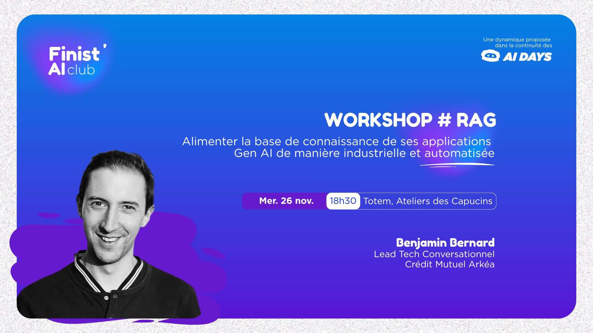

# Workshop : Alimenter la base de connaissance de ses applications Gen AI (chatbot RAG) de manière industrielle et automatisée

## Info réseau

TODO, quel réseau au Toten ?

## Sommaire

* [Partie 1 - Découverte et installation de l'environment](./doc/part1-install_environnement.md)
* [Partie 2 - Vectorisons quelques pages avec Temporal IO](./doc/part2-vect_pages_with_temporal.md)
* [Partie 3 - Clean les pages et les convertir en markdown](./doc/part3-cleaning_pages_in_typescript.md)
* !! [Partie 4 - Crawling et scraping des pages](./doc/part4-crawling_scraping.md) ==> RESTE DU TAFF SUR LE CRAWLING
* [Partie 5 - Éviter les prompts qui explosent, découpons nos documents - Chunking](./doc/part5-chunking.md)
* TODO ouverture partie 6, ouverture vers Qallam et usage avancés (Continue As New...)

