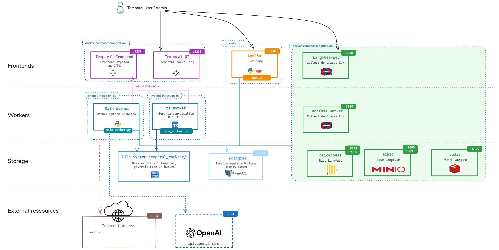
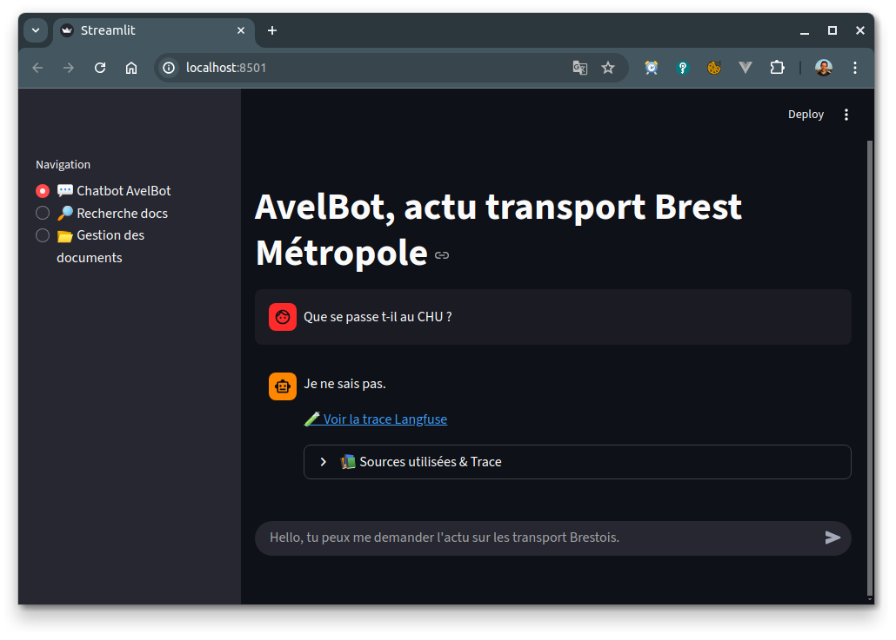
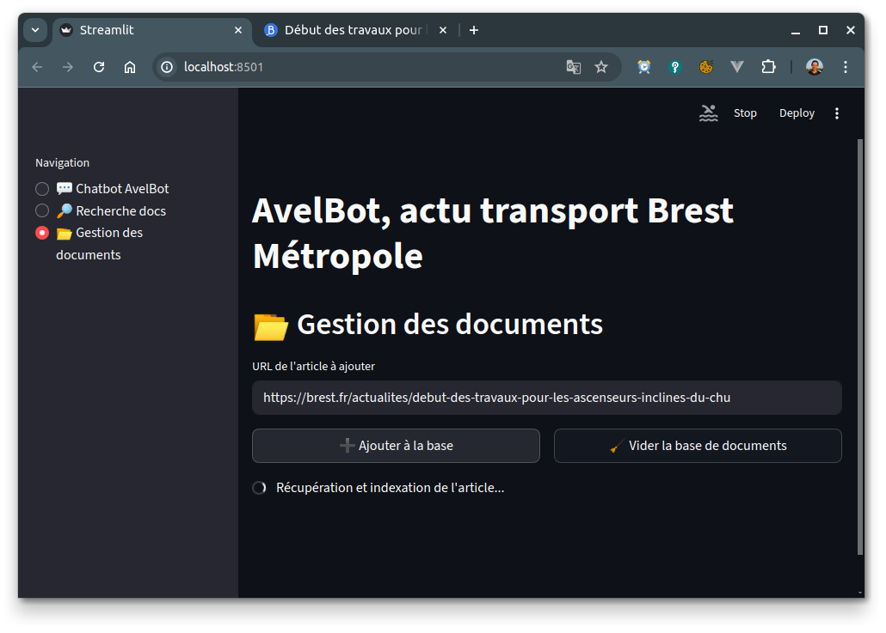
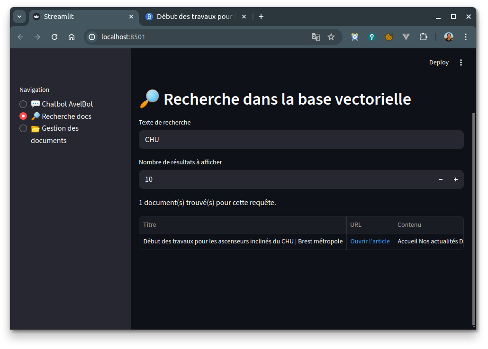

# Partie 1 - Découverte et installation de l'environment

* ⏰ Durée : 20min
* 🎯 Objectifs :
  * Découvrir l'architecture et les divers composants 
  * Lancer AvelBot, bot de démo, ingérer une page
  * Savoir clean la base documentaire, regarder son contenu


## Sommaire

<!-- TOC -->
* [Partie 1 - Découverte et installation de l'environment](#partie-1---découverte-et-installation-de-lenvironment)
  * [Sommaire](#sommaire)
  * [Architecture](#architecture)
  * [Découvrir AvelBot](#découvrir-avelbot)
    * [Pré-requis uv](#pré-requis-uv)
    * [Installation et lancement du Streamlit AvelBot](#installation-et-lancement-du-streamlit-avelbot)
    * [Interroger le bot](#interroger-le-bot)
    * [Ajout un article de Brest FR](#ajout-un-article-de-brest-fr)
    * [Vérifier le contenu de la base documentaire](#vérifier-le-contenu-de-la-base-documentaire)
  * [Langfuse outil d'observabilité](#langfuse-outil-dobservabilité)
<!-- TOC -->

## Architecture



Récap des services et URLs :

| Service | URL                                                                                |
| --- |------------------------------------------------------------------------------------|
| Avel Bot | http://localhost:8501                                                              |
| Temporal | http://localhost:8233                                                              |
| Langfuse | http://localhost:3000  <br> User : `user@example.com` <br> Password: `password123` |

**Vous devez disposer de docker-compose au préalable.**

Lancement de la stack docker :
```bash
cd $(git rev-parse --show-toplevel)/
cp template.env .env
cd docker
chmod a+r scripts/postgres/init.sql
chmod -R a+rX scripts/temporal/dynamicconfig 
docker compose -p worker-temporal-genai --env-file ../.env -f docker-compose.langfuse.yml -f docker-compose.pg.yml -f docker-compose.temporal.yml up -d

# Stopper la Stack sans conserver les volumes :
#  docker compose -p worker-temporal-genai --env-file ../.env -f docker-compose.langfuse.yml -f docker-compose.pg.yml -f docker-compose.temporal.yml down -v
```

## Découvrir AvelBot

### Pré-requis uv
Dans ce workshop nous allons utiliser uv pour gérer votre virtuel env python et dépendances.

Pour l'installer si vous ne l'avez pas déjà suivez les instructions ici : https://docs.astral.sh/uv/getting-started/installation/


### Installation et lancement du Streamlit AvelBot
Lancer l'application Streamlit :
```bash
cd $(git rev-parse --show-toplevel)/
uv sync
source .venv/bin/activate
streamlit run avelbot/app.py
```

Vous pouvez aussi lancer AvelBot via :
* PyCharm, run `AvelBot (Streamlit)`
* VS Code, run `[🐍] AvelBot (Streamlit)`

### Interroger le bot

Posez votre première question dans AvelBot `Que se passe t-il au CHU ?` :



### Ajout un article de Brest FR
Le bot est vide, nous allons lui faire indexer le contenu text de la page (Brest FR - Début des travaux pour les ascenseurs inclinés du CHU)[https://brest.fr/actualites/debut-des-travaux-pour-les-ascenseurs-inclines-du-chu] :
* Aller sur *Gestion des documents*
* Coller cette URL : `https://brest.fr/actualites/debut-des-travaux-pour-les-ascenseurs-inclines-du-chu`


> Vous pouvez aussi via cette interface vider la base vectorielle.

Vous pouvez retourner interroger le bot :)

### Vérifier le contenu de la base documentaire
* Aller sur *Recherche docs*
* Entrer une cherche `CHU`



## Langfuse outil d'observabilité

Sur chaque réponse du bot vous avez un lien vers la trace de l'exécution de la chaine RAG dans langfuse.
Les identifiants sont :
* User: `user@example.com`
* Password: `password123`


Partie suivante : [Part 2 - Vectorisons quelques pages avec Temporal IO](./part2-vect_pages_with_temporal.md)
