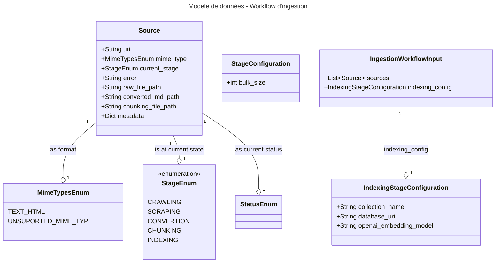
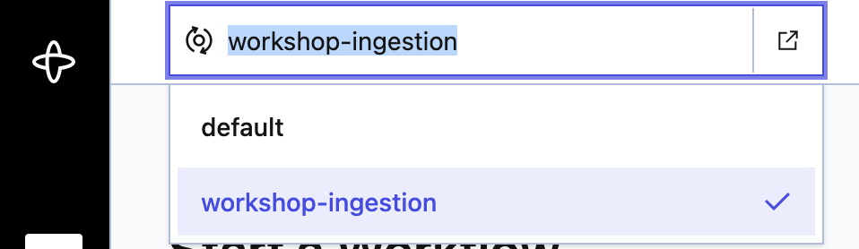
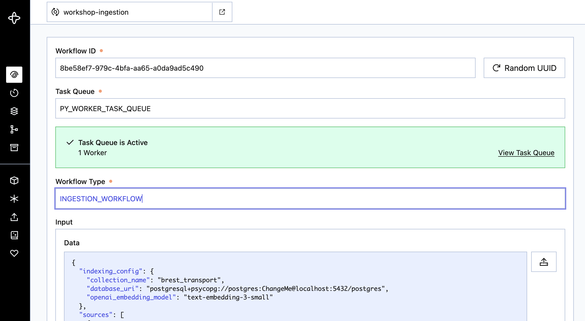

# Part 2 - Vectorisons quelques pages avec Temporal IO

* ⏰ Durée : 30min
* 🎯 Objectifs :
  * Découvrir Temporal et son backoffice
  * Découverte du modèle de données utilisé pendant le workshop
  * Coder et lancer l'activité d'indexation sur des pages web pré-téléchargées

## Découverte de Temporal IO

Temporal IO est une plateforme open-source de gestion de workflows distribués, conçue pour rendre les systèmes complexes
fiables, résilients et faciles à raisonner. Elle permet d’orchestrer des tâches longues, critiques ou dépendantes les
unes des autres (paiements, traitements de données, automatisations métiers, pipelines IA, etc.) tout en garantissant 
la reprise automatique en cas d’erreur, de crash, de déploiement, ou même de redémarrage de machine. Avec Temporal, 
chaque étape d’un workflow est durablement enregistrée dans un “history log”, ce qui élimine la gestion manuelle des 
états, des timeouts, des retry policies, du backoff, ou des verrous distribués.

Concrètement, Temporal sépare la logique métier (les workflows) et l’exécution des actions externes (les activities), 
tout en offrant des primitives puissantes : timers fiables, retours asynchrones, signaux, queries, sous-workflows, et 
une cohérence garantie. Cela permet d’écrire du code simple, comme une fonction normale, qui devient automatiquement 
résistant aux pannes et hautement scalable grâce au moteur de Temporal. C’est aujourd’hui utilisé par des entreprises 
comme Datadog, OVH, Stripe, Snap ou Descript pour orchestrer des milliers à des millions d’opérations de manière sûre et 
déterministe.

### Pourquoi le choix de Temporal IO

Les activités de collecte de données sont des activités longues (un web crawling peut s’étaler sur plusieurs heures),
pour découvrir (crawling) et télécharger (scraping) des milliers de pages web.

Le nettoyage des documents collectés et leur conversion sont également des tâches longues, qui peuvent parfois nécessiter
des ressources GPU (modèles de détection de layout, OCR…) et doivent pouvoir reprendre
sans tout rejouer.

Enfin, l’indexation / vectorisation des documents peut elle aussi, en fonction des modèles utilisés et des ressources
disponibles, s’étaler sur plusieurs heures, voire des jours d’exécution.

### Modèle de données qui serait utilisé

Dans ce workshop, nous allons travailler avec le modèle de données suivant, il est déjà implémenté :
* En python au travers d'objets PyDantic disponible ICI TODO
* En Typescript (nous le verrons par la suite)

En bref :
* **Source** : représente chaque page web tout au long de son traitement
  - source.medata : contien des clé valeur qui arriveront en base vectorielle, notamment la metdata.title qui contien le titre de la page.
* **IngestionWorkflowInput** : représente les données d'entrée de notre workflow



Ce modèle est décrit en json schémas dans *ingestion-workflow-model-schemas*, nous utilisons du json schéma pour 
le décliner en Pydantic et en modèle TypeScript, puisque Temporal nous permet d'implémenter des activités dans plusieurs
langages, nous verrons ceci en partie 4.

*Vous n'aurez pas à toucher aux schémas, si besoin vous avez des Run Config PyCharm / Intelij permettant de les re-générer
en python et typescript.*

### Notre premier workflow

Il est important de retenir qu'un workflow ne peut effectuer que des actions déterministes, il ne peut par exemple pas
aller appeler une API, créer un dossier ou fichier, lire des variables d'environnement.

C'est un concept très important dans Temporal ce sont les activités qui effectuées ces opérations. Ceci permet à Temporal
de mémoriser les entrée / sortie de chaque exécution d'activités (dans l'Event History du Workflow) et en cas de reprise 
d'un workflow pour une même données d'entrée d'une activité retourner la valeur de retour qu'il a enregistré et ainsi ne
pas tout ré-exécuter.

TODO Schéma du workflow
TODO explication des entrées sortie de l'activité de print et indexing.
TODO expliquer les namespace + task_queue.

On va commencer par aller droit au but de manière très simple mettre en base le contenu brute des 2 pages d'article
pré-téléchargée présentes dans *ingestion-workflow-py/ressources/brest_transport_pre_scraped_pages/*.

Le workflow et déjà initialisé ici *ingestion-workflow-py/src/ingestion_workflow/workflows/ingestion_workflow.py*.
Vous pouvez aller regarder le code commenté.

Pour l'instant il ne fait que print la liste des sources avec une activité déjà initialisée dans `ingestion-workflow-py/src/ingestion_workflow/activities/print_source_activity.py`.
Vous pourrez vous en inspirer pour créer l'activité d'indexation.

### Notre premier worker

#### Namespace et Task Queue

Les code des activités et des workflow est exécuté par ce qu'on appel des [Worker Temporal](https://docs.temporal.io/workers).
Ces workers écoutent sur des files d'attentes, task queue pour récupérer des tâches (exécution d'activité ou de workflow),
ici on utilisera une task queue appelée `PY_WORKER_TASK_QUEUE`.
Ces tasks queues sont elles même rangées au sein de namespaces, par défaut la stack docker compose a créé le namespace `workshop-ingestion`. 

TODO Schéma ??

Cas d'usages de task queues différentes :
* Si vous avez des activités nécessitant une GPU, vous aurez 
un worker déployer sur une machine ayant une carte graphique et écoutant sur une Task Queue spécifique.
* Des workers dans différents languages, vous allez pouvoir créer une task queue par langage.
* Si vous souhaitez avoir des worker ayant des droits d'accès différents pour bien isoler les exécutions,
par exemple un worker ayant accès à internet pour le crawling scrapping de sites publiques un autre interne pour vos intranet.


### Créons et lançons Main Worker

Ouvrez `ingestion-workflow-py/src/ingestion_workflow/worker/main_worker.py`, nous allons compléter ce script.

D'abord il vous faut créer un client Temporal :
* Temporal dialogue en GRCP sur localhost:7233
* Nous allons travailler sur le namespace `workshop-ingestion`

```python
from temporalio.client import Client

client: Client = await Client.connect("localhost:7233", namespace="workshop-ingestion")
```

Une fois le client créé vous pouvez créer un Worker Temporal :
* il écoute sur la file d'attente / task queue `PY_WORKER_TASK_QUEUE`
* il est capable d'exécuter le code de notre workflow la classe `IngestionWorkflow`
* il est capable d'exécuter le code de notre activité d'exemple qui print des sources, la fonction `print_source_activity`

Vous pouvez le créer avec le code suivant :

```python
from temporalio.worker import Worker
from avelbot_ingestion.workflows.ingestion_workflow import IngestionWorkflow
from avelbot_ingestion.activities.print_source_activity import print_source_activity
from avelbot_ingestion.worker.utils import build_sandbox_worker_runner_vscode_debug_compatible

worker: Worker = Worker(
  client,
  task_queue="PY_WORKER_TASK_QUEUE",  # Nom de la file sur laquelle écoute le worker
  workflows=[IngestionWorkflow],  # Code des workflow qu'est capable d'exécuter le worker
  activities=[print_source_activity],  # Liste des activités qu'est capable d'exécuter le worker
  debug_mode=True, # Utile en dev
  workflow_runner=build_sandbox_worker_runner_vscode_debug_compatible() # Used to prevent VS Code issue
)
```

> build_sandbox_worker_runner_vscode_debug_compatible permet de créer un context du worker compatible
> avec le debugger de VS Code qui inject la lib _pydevd_bundle que temporal doit laisser passer.

<details>
  <summary>Code complet de `main_worker.py`</summary>

```python
import asyncio

from temporalio.client import Client
from temporalio.worker import Worker

from avelbot_ingestion.activities.print_source_activity import print_source_activity
from avelbot_ingestion.helpers.logging_config import get_app_logger, configure_logging
from avelbot_ingestion.worker.utils import build_sandbox_worker_runner_vscode_debug_compatible
from avelbot_ingestion.workflows.ingestion_workflow import IngestionWorkflow

from dotenv import load_dotenv, find_dotenv

load_dotenv(find_dotenv())
logger = get_app_logger(__name__)

async def main() -> None:
    logger.info("Starting main python worker ...")

    # COMPLETER ICI - START
    # - Initialiser le client temporal
    # - Créer le Worker
    # - Démarrer le worker
    client: Client = await Client.connect("localhost:7233", namespace="workshop-ingestion")
    worker: Worker = Worker(
        client,
        task_queue="PY_WORKER_TASK_QUEUE", # Nom de la file sur laquelle écoute le worker
        workflows=[IngestionWorkflow], # Code des workflow qu'est capable d'exécuter le worker
        activities=[print_source_activity], # Liste des activités qu'est capable d'exécuter le worker
        debug_mode=True,
        workflow_runner=build_sandbox_worker_runner_vscode_debug_compatible() # Used to prevent VS Code issue
    )
    await worker.run()
    # COMPLETER ICI - END

if __name__ == "__main__":
    configure_logging(caller="main_worker") # Configurer un logger avec un peu de couleur
    asyncio.run(main())
```
</details>

Pour lancer le worker **utilisez de préférence** la run configuration PyCharm ou VS Code **Main Worker** ou en ligne de commande :
```bash
cd $(git rev-parse --show-toplevel)/avelbot-ingestion-py/src/avelbot_ingestion/worker
python main_worker.py
```

### Lançons notre premier workflow

### Input d'entrée

Les données d'entrée du workflow correspondent au format `IngestionWorkflowInput`, vous trouverez le ficher commenté
au format yaml ici [part2-vect_pages_with_temporal.yml](../avelbot-ingestion-py/ressources/workflow_inputs/part2-vect_pages_with_temporal.yml).

Temporal UI ne supporte que le format json, les fichiers on donc étaient convertis en json : 
`yq -o=json eval part2-vect_pages_with_temporal.yml > part2-vect_pages_with_temporal.json`)

### Trigger le workflow via Temporal UI

* Allez sur le dashboard Temporal : http://localhost:8233/
* Sélectionner le bon namespace `workshop-ingestion` :

* Cliquer sur le bouton "Start Workflow" :
  * Workflow ID : Random UUID
  * Task Queue : `PY_WORKER_TASK_QUEUE`
  * Workflow Type, nom mis sur le décorateur de la class python du workflow : `INGESTION_WORKFLOW`
  * Input, il s'agit des données d'entrée, ici `part2-vect_pages_with_temporal.json`.
  * Cliquer sur **Start Workflow**

Vous devriez avoir les paramètres suivants :



### Trigger le workflow via une run configuration VS Code ou PyCharm


### En CLI

Il existe un petit script python permettant via le SDK Temporal de trigger un workflow, avec les mêmes paramètres que sur le backoffice (n'hésitez pas à aller le voir) :
```bash
cd $(git rev-parse --show-toplevel)/avelbot-ingestion-py/ressources/workflow_inputs
python ../../src/avelbot_ingestion/runners/trigger_ingestion_workflow.py --workflow-input-yaml=part2-vect_pages_with_temporal.yml
```

#### Via PyCharm

Avec PyCharm vous risquez d'avoir l'erreur suivante au niveau du worker :
```
[ERROR] temporalio.worker._workflow_instance:2711 - Exception in callback <Task pending name='query: __temporal_workflow_metadata (workflow: IngestionWorkflow, id: 94f5bdf3-f7f2-4037-b905-d4f0d23276a0, run: 019ab101-8bfc-7ae5-af76-f85c733c5e47)' coro=<_WorkflowInstanceImpl._apply_query_workflow.<locals>.run_query() running at workshop-temporal-genai-ingestion/.venv/lib/python3.13/site-packages/temporalio/worker/_workflow_instance.py:712> cb=[set.remove()]>()
handle: <Handle <Task pending name='query: __temporal_workflow_metadata (workflow: IngestionWorkflow, id: 94f5bdf3-f7f2-4037-b905-d4f0d23276a0, run: 019ab101-8bfc-7ae5-af76-f85c733c5e47)' coro=<_WorkflowInstanceImpl._apply_query_workflow.<locals>.run_query() running at workshop-temporal-genai-ingestion/.venv/lib/python3.13/site-packages/temporalio/worker/_workflow_instance.py:712> cb=[set.remove()]>()>
```

Ceci est lié à un [bug entre le debugger de PyCharm et AsyncIO](https://youtrack.jetbrains.com/issue/PY-64542),
pour le régler :
* Help > Find Actions > Registry (+ Entrer)
* CTRL + F, chercher **python.debug.asyncio.repl**
* Décocher, relancer PyCharm

Vous pouvez ensuite lancer le workflow via les 2 run configuration suivantes :
* Démarrage du worker avec la configuration **Main Worker**
* Trigger du workflow avec la configuration Trigger Workflow > Part 2 - Indexing pre-fetch pages

#### VS Code et debug

Sur VS Code lancer la configuration `[🐍] Trigger - Part 2 - Indexing pages`.


