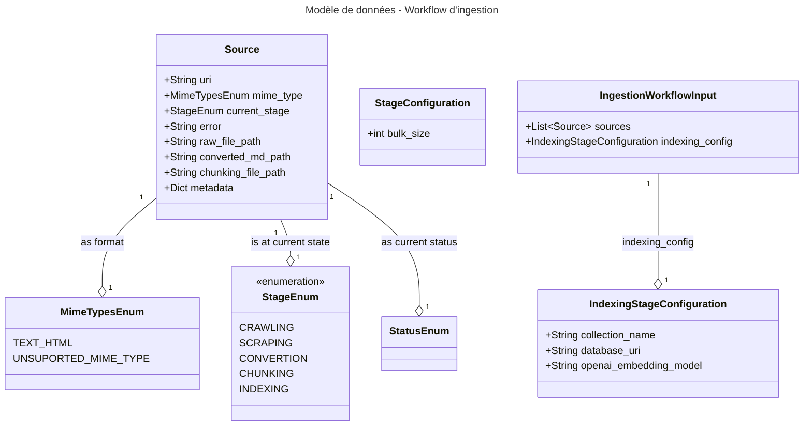

# Part 2 - Vectorisons quelques pages avec Temporal IO

* ⏰ Durée : 30min
* 🎯 Objectifs :
  * Découvrir Temporal et son backoffice
  * Découverte du modèle de données utilisé pendant le workshop
  * Coder et lancer l'activité d'indexation sur des pages web pré-téléchargées

## Découverte de Temporal IO

Temporal IO est une plateforme open-source de gestion de workflows distribués, conçue pour rendre les systèmes complexes
fiables, résilients et faciles à raisonner. Elle permet d’orchestrer des tâches longues, critiques ou dépendantes les
unes des autres (paiements, traitements de données, automatisations métiers, pipelines IA, etc.) tout en garantissant 
la reprise automatique en cas d’erreur, de crash, de déploiement, ou même de redémarrage de machine. Avec Temporal, 
chaque étape d’un workflow est durablement enregistrée dans un “history log”, ce qui élimine la gestion manuelle des 
états, des timeouts, des retry policies, du backoff, ou des verrous distribués.

Concrètement, Temporal sépare la logique métier (les workflows) et l’exécution des actions externes (les activities), 
tout en offrant des primitives puissantes : timers fiables, retours asynchrones, signaux, queries, sous-workflows, et 
une cohérence garantie. Cela permet d’écrire du code simple, comme une fonction normale, qui devient automatiquement 
résistant aux pannes et hautement scalable grâce au moteur de Temporal. C’est aujourd’hui utilisé par des entreprises 
comme Datadog, OVH, Stripe, Snap ou Descript pour orchestrer des milliers à des millions d’opérations de manière sûre et 
déterministe.

### Pourquoi le choix de Temporal IO

Les activités de collecte de données sont des activités longues (un web crawling peut s’étaler sur plusieurs heures),
pour découvrir (crawling) et télécharger (scraping) des milliers de pages web.

Le nettoyage des documents collectés et leur conversion sont également des tâches longues, qui peuvent parfois nécessiter
des ressources GPU (modèles de détection de layout, OCR…) et doivent pouvoir reprendre
sans tout rejouer.

Enfin, l’indexation / vectorisation des documents peut elle aussi, en fonction des modèles utilisés et des ressources
disponibles, s’étaler sur plusieurs heures, voire des jours d’exécution.

### Modèle de données qui serait utilisé

Dans ce workshop, nous allons travailler avec le modèle de données suivant, il est déjà implémenté :
* En python au travers d'objets PyDantic disponible ICI TODO
* En Typescript (nous le verrons par la suite)

En bref :
* **Source** : représente chaque page web tout au long de son traitement
  - source.medata : contien des clé valeur qui arriveront en base vectorielle, notamment la metdata.title qui contien le titre de la page.
* **IngestionWorkflowInput** : représente les données d'entrée de notre workflow

Ce modèle est décrit en json schémas dans *ingestion-workflow-model-schemas*, nous utilisons du json schéma pour 
le décliner en Pydantic et en modèle TypeScript, puisque Temporal nous permet d'implémenter des activités dans plusieurs
langages, nous verrons ceci en partie 4.

*Vous n'aurez pas à toucher aux schémas, si besoin vous avez des Run Config PyCharm / Intelij permettant de les re-générer
en python et typescript.*

### Notre premier workflow

On va commencer par aller droit au but de manière très simple mettre en base le contenu brute des 2 pages d'article
pré-téléchargée présentes dans *ingestion-workflow-py/ressources/brest_transport_pre_scraped_pages/*.

Ouvrez le fichier *ingestion-workflow-py/src/ingestion_workflow/workflows/ingestion_workflow.py* :

