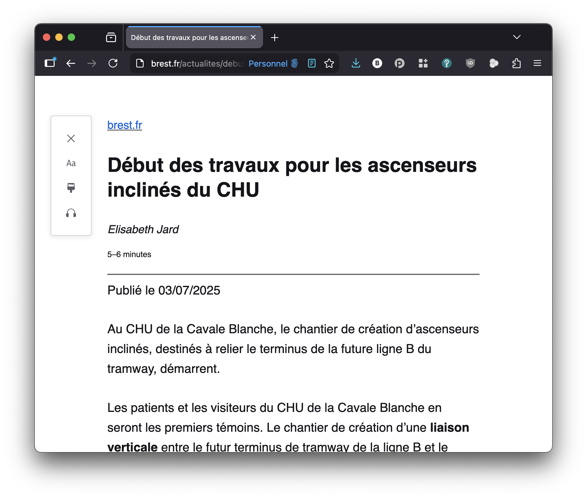
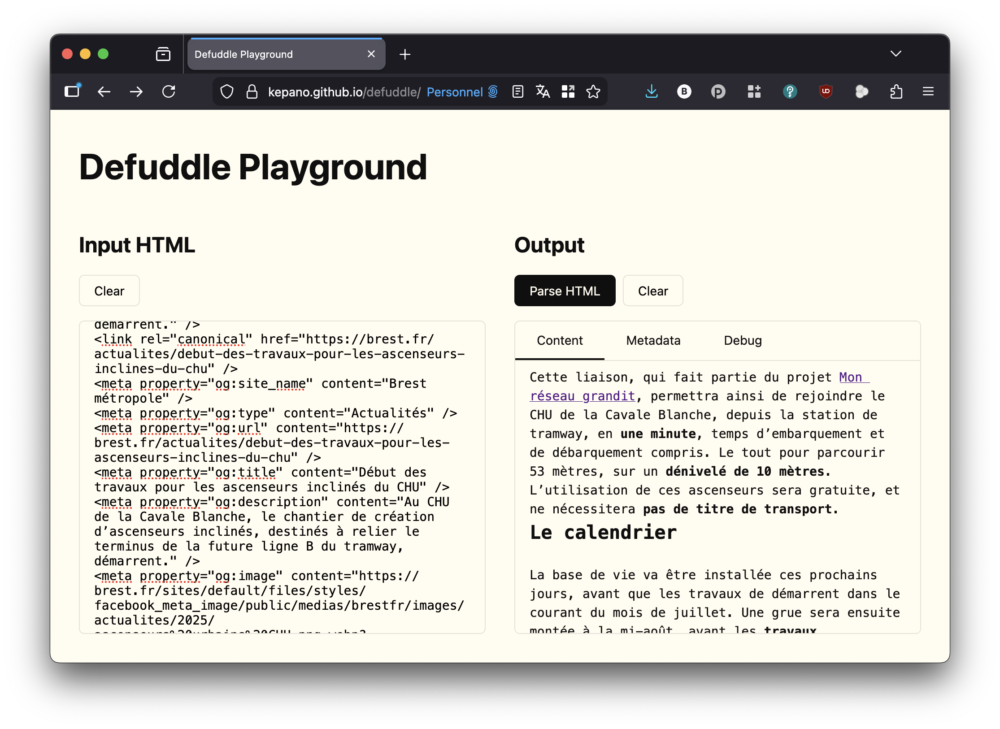
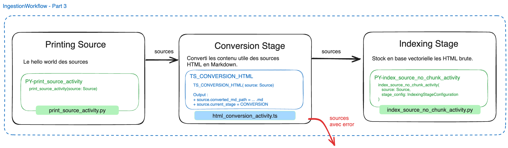
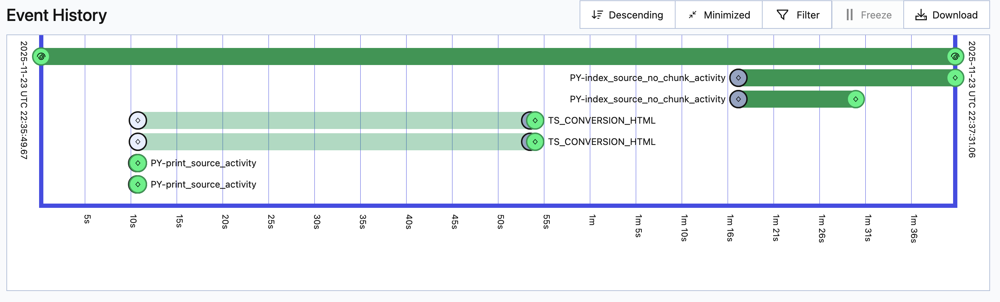
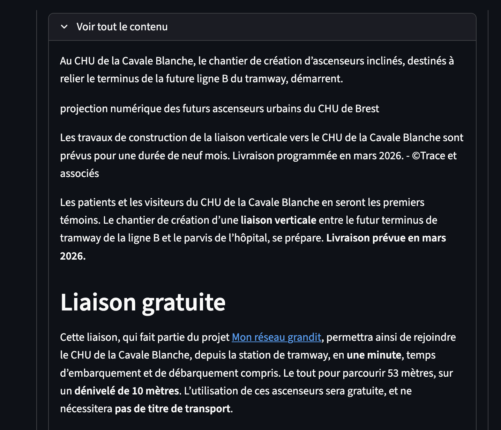

# Partie 3 - Clean les pages et les convertir en markdown

* ⏰ Durée : 25min
* 🎯 Objectifs :
  * Découvrir Defuddle
  * Compléter l'activité TypeScript
  * Clean les page web en appelant l'activité TS dans le workflow python

<!-- TOC -->
* [Partie 3 - Clean les pages et les convertir en markdown](#partie-3---clean-les-pages-et-les-convertir-en-markdown)
  * [Découverte de Defuddle](#découverte-de-defuddle)
  * [Testons Defuddle sur nos 2 pages](#testons-defuddle-sur-nos-2-pages)
  * [Defuddle en TypeScript](#defuddle-en-typescript)
    * [Check votre version de node](#check-votre-version-de-node)
    * [Installation des dépendence](#installation-des-dépendence)
  * [Compléter l'activité TS](#compléter-lactivité-ts)
    * [Ajouter cette conversion à notre workflow](#ajouter-cette-conversion-à-notre-workflow)
      * [Ajuster l'activité d'indexation](#ajuster-lactivité-dindexation)
    * [Lancer le workflow et voir le résultat](#lancer-le-workflow-et-voir-le-résultat)
<!-- TOC -->

## Découverte de Defuddle

Il n'est pas toujours simple d'extraire d'une page web le contenu dit "utile" c'est-à-dire :
* Sans les menus, footer
* Identifier les corps de la page (contenu de l'article)
* Sans les pubs..

Cette problématique est déjà résolue au sein des navigateurs web via le "Mode lecture", ce mode épure la page web
c'est exactement ce que nous cherchons à faire. Exemple ici sur firefox [sur cette page](https://brest.fr/actualites/debut-des-travaux-pour-les-ascenseurs-inclines-du-chu) :



C'est en partant de cette idée que nous avons découvert [Readability](https://github.com/mozilla/readability), la
librairie derrière ce mode magique.

Readability utilise de nombreuses règles et heuristiques pour trouver le contenu utile de la page
ces règles peuvent s'avérer complexe à comprendre et ne donnent pas toujours de bons résultat, au fil de nos recherches
nous sommes tombés sur [Defudle](https://github.com/kepano/defuddle) décrit comme une solution de remplacement à Readability :

> Defuddle can be used as a replacement for Mozilla Readability with a few differences:
>
>    - More forgiving, removes fewer uncertain elements.
>    - Provides a consistent output for footnotes, math, code blocks, etc.
>    - Uses a page's mobile styles to guess at unnecessary elements.
>    - Extracts more metadata from the page, including schema.org data.

Cette librairie est d'autant plus intéressant qu'elle est pensé pour un usage de convertion des pages
vers du Markdown.

Le Markdown étant bien compris par les LLM tout en conservant la structure des documents il est aussi beaucoup plus
léger en coût / nombre de token, je vous invite à voir cet article sur le sujet [Why Are the New AI Agents Choosing Markdown Over HTML?](https://hackernoon.com/why-are-the-new-ai-agents-choosing-markdown-over-html)

## Testons Defuddle sur nos 2 pages

Defuddle met à disposition un playground en ligne qui permet de tester rapidement la conversion :
https://kepano.github.io/defuddle/

Vous pouvez copier / coller les contenus des 2 pages :
* [debut-des-travaux-pour-les-ascenseurs-inclines-du-chu.html](../avelbot-ingestion-py/ressources/brest_transport_pre_scraped_pages/debut-des-travaux-pour-les-ascenseurs-inclines-du-chu.html)
* [palaren-un-belvedere-sur-rade-en-preparation.html](../avelbot-ingestion-py/ressources/brest_transport_pre_scraped_pages/palaren-un-belvedere-sur-rade-en-preparation.html)



## Defuddle en TypeScript

### Check votre version de node

Dans cette partie nous allons travailler sur une activité développée en typescript, version de node conseillée :
```bash
node --version
# v24.11.0
npm --version
# 11.6.2
```

Si vous avez nvm vous pouvez l'installer via :
```bash
nvm install v24.11.0
nvm use v24.11.0
```

### Installation des dépendence

```bash
cd $(git rev-parse --show-toplevel)/avelbot-ingestion-ts/
npm ci
```

## Compléter l'activité TS

Pour aller plus vite nous avons déjà développé le worker typescript qui écoute sur la task queue `TS-DEFAULT-TASK_QUEUE`.

Il ne vous reste qu'à compléter l'activité pré-initialisée dans [html_conversion_activity.ts](../avelbot-ingestion-ts/src/html_conversion_activity.ts), a partir de :
```typescript
// COMPLETER ICI - START - Partie 3
```

* Nous allons d'abord lire la source HTML
```typescript
const html_source = await fs.readFile(source_raw_file_path, { encoding: "utf-8" });
```
* Initialiser un dom avec cette source :
```typescript
const jsdom = new JSDOM(html_source, { url: source.uri, pretendToBeVisual: true });
const window = jsdom.window;
const document = window.document;
```
* Lancer Defuddle sur ce document et le parser dans article :
```typescript
const defuddle = new Defuddle(document);
const article = defuddle.parse();
```
* Puis convertir le contenu HTML filtré par Defuddle en markdown avec [TurnDown](https://github.com/mixmark-io/turndown) :
```typescript
const turndownService = new TurndownService();
const markdown = turndownService.turndown(article.content);
```
* Peupler la metadonnée title avec le titre parse par Defuddle :
```typescript
// Peupler les metadonnées.
source.metadata ??= {}; // S'assure que source.metadata est initialisé
source.metadata['title'] = article.title;
console.log("Extracted title %s", article);
// COMPLETER ICI - END - Partie 3
```
* Le reste du code gère la sauvegarde de la source markdown dans le dossier de travail du workflow. Ce dossier est situé
dans `temporal_workdir` et porte l'UUID du workflow, vous y retrouverez un dossier `convertion`.

> Le dossier temporal_workdir est utilisé car la taille des payloads d'entrée / sortie des activités sont limitées
> voir [Transaction Payload size limit](https://docs.temporal.io/cloud/limits#transaction-payload-size-limit) à 2MB.
> En effet Temporal mémorise ses informations dans l'Event History qui lui aussi et limité.
> 
> Il est donc nécessaire de véhiculer les données "lourde" au travers d'un système de fichier partagé. 
> Par exemple un bucket S3 monté sur vos workers (attention néanmoins aux caches des drivers).


### Ajouter cette conversion à notre workflow

On va revoir notre workflow pour intégrer cette nouvelle activité :


Dans [ingestion_workflow.py](../avelbot-ingestion-py/src/avelbot_ingestion/workflows/ingestion_workflow.py) :
```python
# COMPLETER ICI - START (partie 3)
# - appeler l'activité "TS_CONVERSION_HTML"
...
# COMPLETER ICI - END
```

Ayez en tête que l'activité Typescript de conversion s'appelle `TS_CONVERSION_HTML`, que le worker Typescript qui la
supporte écoute sur la task queue `TS_WORKER_TASK_QUEUE`.
Elle prend en entrée uniquement une source et est à exécuter sur toutes les sources.

Attention elle peut sortir des sources en erreur qui sont à exclure de la suite du workflow.

Avec ces éléments vous devriez y arriver 😉, sinon solution ci-dessous. Pour tester vous
aurez besoin d'aller jusqu'au lancement du workflow.

<details>
  <summary>Solution ingestion_workflow.py</summary>

```python
# COMPLETER ICI - START (partie 3)
# - appeler l'activité "TS_CONVERSION_HTML"
conversion_tasks = [
    workflow.execute_activity(
        activity="TS_CONVERSION_HTML",
        task_queue="TS_WORKER_TASK_QUEUE",
        args=[source],
        start_to_close_timeout=timedelta(seconds=WORKFLOW_ACTIVITY_START_TO_CLOSE_TIMEOUT),
    )
    for source in sources
]
sources, err_sources = split_sources_by_error(await asyncio.gather(*conversion_tasks))
sources_with_errors.extend(err_sources)
# COMPLETER ICI - END
```

Fichier complet à ce stade :
```python
import asyncio
import logging
import os
from datetime import timedelta
from typing import List

from temporalio import workflow

from avelbot_ingestion.helpers.logging_config import get_app_logger
from avelbot_ingestion.models.IngestionWorkflowInput import IngestionWorkflowInput
from avelbot_ingestion.models.Source import Source
from avelbot_ingestion.workflows.utils import split_sources_by_error

logger = get_app_logger(__name__)

WORKFLOW_ACTIVITY_START_TO_CLOSE_TIMEOUT= int(os.getenv("WORKFLOW_ACTIVITY_START_TO_CLOSE_TIMEOUT", 300)) # Default 300s, 5min

@workflow.defn(name="IngestionWorkflow")
class IngestionWorkflow:
    @workflow.run
    async def run(self, ingestion_workflow_input: IngestionWorkflowInput) -> str:

        logging.info("IngestionWorkflow started.")
        sources = ingestion_workflow_input.sources
        sources_with_errors : List[Source] = [] # Contiendra les sources en erreur.

        # -- Démarrage d'un pool d'activitées en parallèle sur toutes les sources --
        printing_tasks = [
            # NE PAS AWAIT ICI
            workflow.execute_activity(
                activity="PY-print_source_activity",
                task_queue="PY_WORKER_TASK_QUEUE",
                args=[source],
                start_to_close_timeout=timedelta(seconds=WORKFLOW_ACTIVITY_START_TO_CLOSE_TIMEOUT),
            )
            for source in sources
        ]
        # Exécute toutes les tâches en parallèle sur chaques sources
        # Sépare les sources ayant une erreur pour les sortie de la suite des exécutions
        sources, err_sources = split_sources_by_error(await asyncio.gather(*printing_tasks))
        sources_with_errors.extend(err_sources)

        # COMPLETER ICI - START (partie 3)
        # - appeler l'activité "TS_CONVERSION_HTML"
        conversion_tasks = [
            workflow.execute_activity(
                activity="TS_CONVERSION_HTML",
                task_queue="TS_WORKER_TASK_QUEUE",
                args=[source],
                start_to_close_timeout=timedelta(seconds=WORKFLOW_ACTIVITY_START_TO_CLOSE_TIMEOUT),
            )
            for source in sources
        ]
        sources, err_sources = split_sources_by_error(await asyncio.gather(*conversion_tasks))
        sources_with_errors.extend(err_sources)
        # COMPLETER ICI - END

        # COMPLETER ICI / Décommenter ici - START (partie 2)
        # - Décommenter les lignes suivantes
        # - Compléter l'activitée index_source_no_chunk_activity
        indexing_tasks = [
            workflow.execute_activity(
                activity="PY-index_source_no_chunk_activity",
                task_queue="PY_WORKER_TASK_QUEUE",
                args=[source, ingestion_workflow_input.indexing_config], # Ne pas oublier de passer le paramètre supplémentaire ici
                start_to_close_timeout=timedelta(seconds=WORKFLOW_ACTIVITY_START_TO_CLOSE_TIMEOUT),
            )
            for source in sources
        ]
        sources = await asyncio.gather(*indexing_tasks)  # Exécute toutes les tâches en parallèle sur chaques sources
        logger.info("Nombre de sources indexés : %i", len(sources))
        # COMPLETER ICI - END

        return f"Handeled {len(sources)} sources, sources with errors: {len(err_sources)}"

```

</details>

#### Ajuster l'activité d'indexation

L'activité d'indexation vectorise `source.raw_file_path` or maintenant, nous allons tirer profit de
`source.converted_md_path` qui est peuplé par l'activité de conversion.

Pensez à ajuster dans [index_source_no_chunk_activity.py](../avelbot-ingestion-py/src/avelbot_ingestion/activities/index_source_no_chunk_activity.py) :
```python
with open(source.raw_file_path, "r", encoding="utf-8") as f:
```
Qui devient :
```python
with open(source.converted_md_path, "r", encoding="utf-8") as f:
```
Et relancer le Main worker python.

### Lancer le workflow et voir le résultat

Vous pouvez maintenant :
* Retourner sur AvelBot et supprimer les documents en base.
* Aller sur Temporal UI, Terminate les workflow en cours dans le namespace `workshop-ingestion`
* Relancer / Lancer les workers :
  * Main Worker python : PyCharm `Main Worker`  | VS Code `[🐍] Main Worker`
  * Worker TypeScript : PyCharm `TS Worker` | VS Code `[🔷] Worker TS`
* Déclencher le workflow, même configuration que pour la partie 2 : PyCharm `Part 2 - Indexing workflow pre-fetch pages` | VS Code `[🐍] Trigger - Part 2 - Indexing pages`

Vous devez avoir le workflow suivant : 


Allez tester et vérifier sur [AvelBot](http://localhost:8501/) que vos documents sont bien en markdown, par exemple en
demandant `Quelle est le concept original de l'ascenseur du CHU ?` et étendre les documents :


> N'hésitez pas aller regarder la trace langfuse la latence et le nombre de tokens devraient être meilleure

C'est bien beau mais depuis tout à l'heure on ne travail que sur 2 pages, pré-téléchargés, nous allons
dans la partie 3 aller crawler (parcourir) et scraper (les autres pages).

Aller à la [Partie 4 : Partie 4 - Collectons les pages automatiquement](./part3-cleaning_pages_in_typescript.md)
