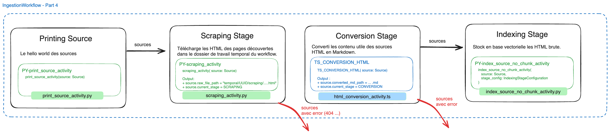

# Partie 4 - Crawling et scraping des pages

* ⏰ Durée : 25min
* 🎯 Objectifs :
  * Création de l’activité de Scraping qui depuis une source avec URI va télécharger la page.
  * Appeler l'activité de crawling en amont
  * Comprendre le concept de Continue As New

TODO TOC

## Création de l'activité de Scraping

Ajoutons d'abord une activité qui depuis l'URL d'une page web dont on sait qu'il s'agit d'une page HTML (mime_type: text/html)
est capable la télécharger dans le dossier de travail temporal.



Arborescence du dossier que nous souhaitons avoir :
```
temporal_workdir/
│
└── {uuid-workflow}/
    │
    ├── scraping/                 # Pages HTML brutes récupérées, en fin de stage de scraping
    │   ├── brest.fr_actualites_palaren-un-belvedere-sur-rade-en-preparation.html
    │   └── brest.fr_actualites_debut-des-travaux-pour-les-ascenseurs-inclines-du-chu.html
    │
    └── conversion/               # Fichiers Markdown convertis, en fin de stage de convertion
        ├── brest.fr_actualites_palaren-un-belvedere-sur-rade-en-preparation.html.md
        └── brest.fr_actualites_debut-des-travaux-pour-les-ascenseurs-inclines-du-chu.html.md
```

Vous pourrez utiliser la librairie requests pour télécharger les fichiers a vous de jouer et de compléter le fichier
[scraping_activity.py](../avelbot-ingestion-py/src/avelbot_ingestion/activities/scraping_activity.py) en vous inspirant
par exemple de [print_source_activity.py](../avelbot-ingestion-py/src/avelbot_ingestion/activities/print_source_activity.py).

Le cadre et le suivant :
* L'activité s'appelle `PY-scraping_activity`.
* Elle prend en entrée une source.
* Elle doit s'assurer que le dossier `scraping` existe en sachant que le worker s'exécute depuis la racine du projet git,
donc que `./temporal_workdir` pointe bien vers le dossier de travail de Temporal.
  * Vous pouvez accéder à l'UUID du workflow courant en utilisant
```python
from temporalio import activity

workflow_id = activity.info().workflow_id
```
* Vérifier que la source est bien de type `MimeTypesEnum.text_html`, sinon la marquer en erreur.
* Vous pouvez utiliser requests pour télécharger en GET les sources.
* Vous pouvez vous aider de TODO fonction utilitaire pour générer un nom normalisé depuis une URI :
```python
from avelbot_ingestion.helpers.url_helpers import url_to_file_name

url_to_file_name(source.uri)
```
* ⚠ N'oubliez pas toutes nouvelle activité doit être référencée sur un worker 😉
* Vous pouvez tester à l'aide de la run configuration PyCharm `Part 4.a - Scraping`

Si besoin la solution ci-dessous ⬇️.

<details>
  <summary>Solution scraping_activity.py</summary>

```python
# COMPLETER ICI - START (partie 4)
import os
from temporalio import activity

from avelbot_ingestion.helpers.logging_config import get_app_logger
from avelbot_ingestion.helpers.url_helpers import url_to_file_name
from avelbot_ingestion.models.MimeTypesEnum import MimeTypesEnum
from avelbot_ingestion.models.Source import Source

import requests
from pathlib import Path

from avelbot_ingestion.models.StageEnum import StageEnum

logger = get_app_logger(__name__)

@activity.defn(name="PY-scraping_activity")
async def scraping_activity(source: Source) -> Source:
    """
    Activitée qui télécharge une page web.

    :param source: Source a télécharger.
    """
    logger.info(" ---- scraping_activity for %s ----", source.uri)

    if source.mime_type != MimeTypesEnum.text_html:
        source.error = "Not and HTML mime type, can't be scraped."
        return source

    source.current_stage = StageEnum.SCRAPING

    # Ensure output directory exists
    workflow_id = activity.info().workflow_id
    scraping_directory = Path("temporal_workdir") / workflow_id / "scraping"
    os.makedirs(scraping_directory, exist_ok=True)
    output_raw_file_path = Path(scraping_directory) / f"{url_to_file_name(source.uri)}.html"

    # Download page
    try:
        resp = requests.get(source.uri, timeout=10)
        resp.raise_for_status()

        output_raw_file_path.write_text(resp.text, encoding="utf-8")
        source.raw_file_path = str(output_raw_file_path)
    except Exception as e:
        source.error = f"Failed to download page: {e}"

    return  source

# COMPLETER ICI - END (partie 4)
```
</details>

## Appel de l'activité de Crawling

TODO, dev cette activité :
* a base de beautiful soup.
* avec pagination
* introduire en option le Continue As New ? + bulk size ?

## Tester l'ensemble

TODO

Partie suivant : Chunking TODO.
