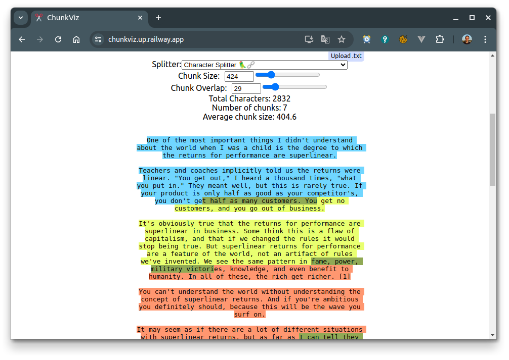
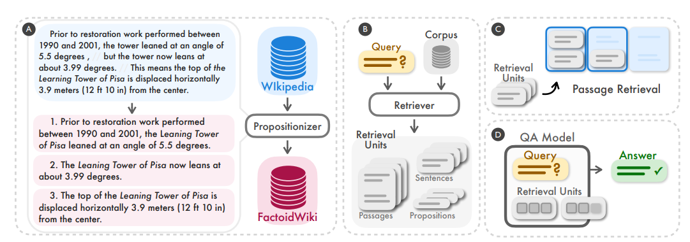
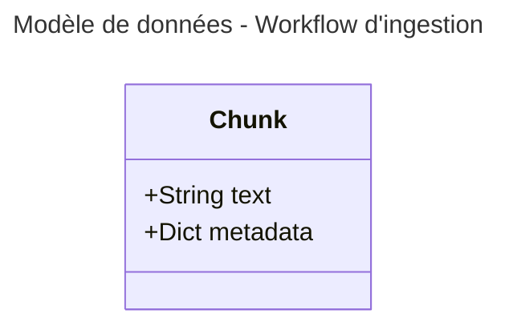
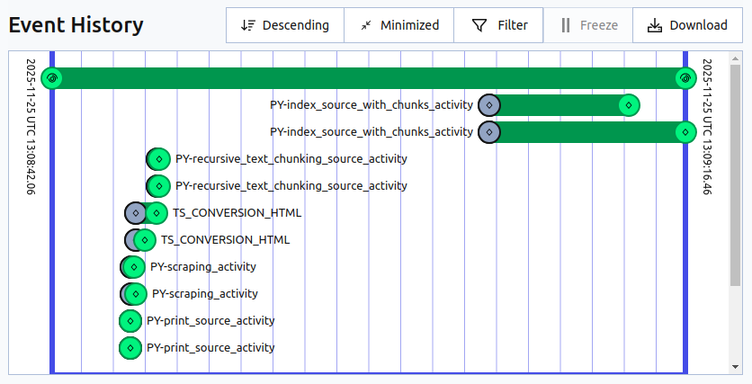
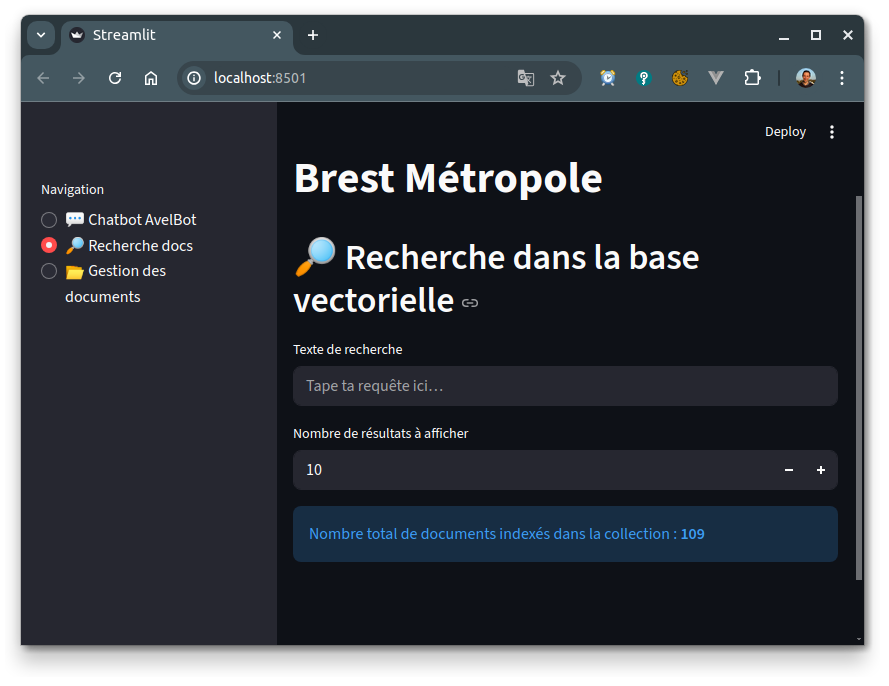

# Partie 5 - Éviter les prompts qui explosent, découpons nos documents - Chunking

* ⏰ Durée : 25min
* 🎯 Objectifs :
  * Pourquoi chunker ? problématique et approches.
  * Adaptation de l’activité d’indexing pour qu'elle ingère le chunks générés.
  * Voir l'impact sur le prompt

## Pourquoi chunker ? problématique et approches

<!-- Explication à l'oral -->
Le **chunking** est essentiel en RAG parce qu’un document brut (PDF, page web, note interne…) est souvent trop long ou trop dense pour être utilisé directement par un modèle d’IA. Les modèles d’embeddings ont aussi une **fenêtre de contexte limitée** : ils ne peuvent encoder efficacement qu’un certain nombre de tokens à la fois. En découpant un document en **morceaux cohérents et de taille maîtrisée**, on garantit que chaque chunk contient une idée claire, encodable proprement, avec un embedding représentatif. Sans chunking, un embedding couvrirait un énorme bloc d’information hétérogène, perdant en précision et rendant la récupération beaucoup moins pertinente.

Le chunking améliore également la **qualité de la recherche** dans le RAG. Lorsqu’une question est posée, le moteur vectoriel recherche les chunks les plus proches sémantiquement. Si les documents ne sont pas découpés, la similarité serait calculée sur des blocs gigantesques, entraînant des réponses trop génériques ou une dilution de l’information utile. Avec des chunks bien calibrés, le système peut retrouver exactement le passage pertinent — un paragraphe technique, une règle métier, un extrait juridique — plutôt que tout un chapitre inutile.

Enfin, le chunking permet un **contrôle fin du contexte injecté au modèle**. On peut éviter de surcharger l’appel LLM avec des centaines de pages, réduire les coûts, et minimiser les risques d’erreurs (hallucinations, contradictions entre parties du document). Le chunking sert donc à maximiser la **précision, la pertinence et l’efficacité** du pipeline RAG, tout en améliorant la robustesse du système.

Il existe différentes approches de chunking les plus connues sont, je vous invite à voir ce thread :
[5 Chunking Techniques](https://www.threads.com/@weaviate.io/post/DAIvRkKq_ky) :

### Recursive Character Text Splitting (approche “cascade” de LangChain)

Découpe en privilégiant les séparateurs : d’abord les titres → paragraphes → phrases → caractères.
* ✔️ Maintient des chunks cohérents tout en respectant une taille max
* ❌ Peut être moins pertinent que du pur chunking sémantique

Je vous invite à tester [ce playground](https://chunkviz.up.railway.app/) pour avoir une idée du résultat :


### Chunking sémantique (Semantic similarity chunking)
Utilise un modèle (embeddings ou LLM) pour détecter les transitions sémantiques et regrouper les phrases qui parlent du même sujet.
* ✔️ Chunks très pertinents et cohérents
* ❌ Plus coûteux et complexe

### Dense X Retrieval (un exemple de chunking par LLM)

Découpe le document en petits passages denses (souvent 100–200 tokens), optimisés pour créer des embeddings très précis. Chaque passage est ensuite indexé dans un moteur de recherche dense (vector store).
* ✔️ Très performant pour le matching sémantique fin, idéal pour les questions précises
* ❌ Requiert plus de chunks → plus d’indexation et plus de stockage



Article intéressant sur le sujet [E14 : Dense X Retrieval](https://medium.com/papers-i-found/e14-dense-x-retrieval-d340d20188d3)

## Adaptation de l’activité d’indexing pour qu'elle ingère le chunks générés

### Modèle de données et stockage des chunks

Nous allons utiliser le Recursive Text Splitter et créer une activitée qui split le markdown de chaques sources en en liste
de chunks.



Nous allons stocker les chunks dans chaques sources dans un fichier yaml localisé comme suit : 
```
temporal_workdir/
│
└── {uuid-workflow}/
    │
    ├── scraping/                   # Pages HTML brutes récupérées, en fin de stage de scraping
    │   ├── brest.fr_actualites_palaren-un-belvedere-sur-rade-en-preparation.html
    │   └── brest.fr_actualites_debut-des-travaux-pour-les-ascenseurs-inclines-du-chu.html
    │
    ├── conversion/                 # Fichiers Markdown convertis, en fin de stage de conversion
    │   ├── brest.fr_actualites_palaren-un-belvedere-sur-rade-en-preparation.html.md
    │   └── brest.fr_actualites_debut-des-travaux-pour-les-ascenseurs-inclines-du-chu.html.md
    │
    └── chunking/                   # Résultat du découpage en chunks
        ├── brest.fr_actualites_palaren-un-belvedere-sur-rade-en-preparation__chunks.yaml
        └── brest.fr_actualites_palaren-un-belvedere-sur-rade-en-preparation__chunks.yaml
```

Exemple de fichier :
```yaml
- text: "*   [Aller au contenu](#MainWrapper)\n\n [](/)"
  metadata:
    title: Début des travaux pour les ascenseurs inclinés du CHU
- text: "*   [Recherche](/rechercher)\n    \n*   [.st0{fill:#3A73DC;} Démarches](/gerer-mon-quotidien/mes-demarches)\n\
    *   Menu\n    \n    *   Gérer mon quotidien\n        \n        Retour\n      \
    \  \n        *   [Démarches](/gerer-mon-quotidien/mes-demarches)\n        *  \
    \ Petite enfance\n            \n            Retour\n            \n           \
    \ *   [Relais petite enfance : un guichet unique pour les parents](/gerer-mon-quotidien/petite-enfance/les-relais-petite-enfance-un-guichet-unique-pour-les-parents-et)\n\
    \            *   [Accueillir un enfant : avant et après la naissance](/gerer-mon-quotidien/petite-enfance/accueillir-un-enfant-avant-et-apres-la-naissance-ladoption)"
  metadata:
    title: Début des travaux pour les ascenseurs inclinés du CHU
```

### Compléter l'activitée

On va compléter l'activitée de chunking text recursif, ouvrez le fichier [recursive_text_chunking_source_activity.py](../avelbot-ingestion-py/src/avelbot_ingestion/activities/recursive_text_chunking_source_activity.py) :
* Lire le contenu markdown de la source `source.converted_md_path` avec `aiofiles` : 
```python
async with aiofiles.open(source.converted_md_path, mode="r", encoding="utf-8") as src_file:
    source_content = await src_file.read()
```
* Créer le splitter langchain RecursiveCharacterTextSplitter à l'aide des paramètres présent dans l'input du workflow, je vous invite à voir le fichier [part5-chunking_recursive.yml](../avelbot-ingestion-py/ressources/workflow_inputs/part5-chunking_recursive.yml) qui sera utilisé et contient ces paramètres :
```python
text_splitter = RecursiveCharacterTextSplitter(
    chunk_size=recursive_chunking_stage_config.chunk_size,
    chunk_overlap=recursive_chunking_stage_config.chunk_overlap,
)
chunks_texts = text_splitter.split_text(source_content)
```
* Les convertir en Chunk de notre modèle en reportant bien les metadata de la source : 
```python
for text in chunks_texts:
    chunks.append(Chunk(text=text, metadata=source.metadata))
```
* Sauvegarder le tout dans le fichier dans le chemin est disponible via `source_chunks_file_path`, penser à la renseigner sur la source :
```python
await save_chunks_yaml(chunks, source_chunks_file_path)
    source.chunking_file_path = str(source_chunks_file_path)
```

<details>
 <summary>Block complet solution `recursive_text_chunking_source_activity.py` </summary>

```python
# COMPLETER ICI - START (partie 5)
async with aiofiles.open(source.converted_md_path, mode="r", encoding="utf-8") as src_file:
    source_content = await src_file.read()

text_splitter = RecursiveCharacterTextSplitter(
    chunk_size=recursive_chunking_stage_config.chunk_size,
    chunk_overlap=recursive_chunking_stage_config.chunk_overlap,
)
chunks_texts = text_splitter.split_text(source_content)

for text in chunks_texts:
    chunks.append(Chunk(text=text, metadata=source.metadata))

await save_chunks_yaml(chunks, source_chunks_file_path)
source.chunking_file_path = str(source_chunks_file_path)
# COMPLETER ICI - END (partie 5)
```
</details>

### Appeler l'activitée depuis le workflow

Cette activitée n'est pas appelée depuis le workflow pour l'instant, le code est déjà près il vous suffit de décommenter.

Ouvrez le fichier [ingestion_workflow.py](../avelbot-ingestion-py/src/avelbot_ingestion/workflows/ingestion_workflow.py),
décommentez la partie 5 :
```python
# COMPLETER ICI - START (partie 5)
# Décommenter les lignes suivante
sources = await recursive_text_chunking_stage(sources, ingestion_workflow_input.recursive_chunking_config)
sources, err_sources = split_sources_by_error(sources)
sources_with_errors.extend(err_sources)
# Penser à changer l'activité d'indexing "index_source_no_chunk_activity" par "index_source_with_chunks_activity"
# COMPLETER ICI - END (partie 5)
```

### Replacement de l'activité d'indexation dans le workflow

Nous allons appeler une activitée d'indexation qui se base sur ce fichier de chunks pour avoir en base 1 document par chunk
est plus 1 document avec le contenu complet de la source.
Cette activité est située ici [index_source_with_chunks_activity.py](../avelbot-ingestion-py/src/avelbot_ingestion/activities/index_source_with_chunks_activity.py),
elle s'appelle `index_source_with_chunks_activity`.

Vous devez adapter le workflow [ingestion_workflow.py](../avelbot-ingestion-py/src/avelbot_ingestion/workflows/ingestion_workflow.py)
pour qu'elle appel cette activité à la place de l'ancienne. Comme ci-dessous :

```python
indexing_tasks = [
    workflow.execute_activity(
        activity=index_source_with_chunks_activity,
        task_queue="PY_WORKER_TASK_QUEUE",
        args=[source, ingestion_workflow_input.indexing_config], # Ne pas oublier de passer le paramètre supplémentaire ici
        start_to_close_timeout=timedelta(seconds=WORKFLOW_ACTIVITY_START_TO_CLOSE_TIMEOUT),
    )
    for source in sources
]
```

### Bien s'assurer que le worker gères ces activités

⚠️ Bien penser à ajouter les 2 activités aux Main Worker dans [main_worker.py](../avelbot-ingestion-py/src/avelbot_ingestion/worker/main_worker.py) :
```python
worker: Worker = Worker(
        client,
        task_queue="PY_WORKER_TASK_QUEUE", # Nom de la file sur laquelle écoute le worker
        workflows=[IngestionWorkflow], # Code des workflow qu'est capable d'exécuter le worker
        activities=[print_source_activity, # Liste des activités qu'est capable d'exécuter le worker
                    index_source_no_chunk_activity,
                    scraping_activity,
                    crawling_activity,
                    recursive_text_chunking_source_activity, # Ajouté ici !!
                    index_source_with_chunks_activity # Ajouté ici !!
                    ],
        debug_mode=True,
        workflow_runner=build_sandbox_worker_runner_vscode_debug_compatible() # Used to prevent VS Code issue
    )
```

### Lancer le workflow

Nous allons partir des 2 articles déjà crawlés.
* PyCharm `Part 5 - Chunking Rec (2 articles)` basée sur [part5-chunking_recursive.yml](../avelbot-ingestion-py/ressources/workflow_inputs/part5-chunking_recursive.yml) 
* VS Code `[🐍] Trigger - Part 5 - Chunking Rec (2 articles)`
* En terminal : 
```bash
cd $(git rev-parse --show-toplevel)/avelbot-ingestion-py/ressources/workflow_inputs
python ../../src/avelbot_ingestion/runners/trigger_ingestion_workflow.py --workflow-input-yaml=part5-chunking_recursive.yml
```

## Voir l'impact sur le prompt

Vous devriez avoir le workflow suivant :


Retournez voir le nombre de documents dans votre base vectorielle et interroger le bot pour voir beaucoup plus de
documents et dans prompt plus léger dans les traces langfuse.

Vous devriez avoir **~100 documents** :



Partie suivante : PARTIE FINALE TODO